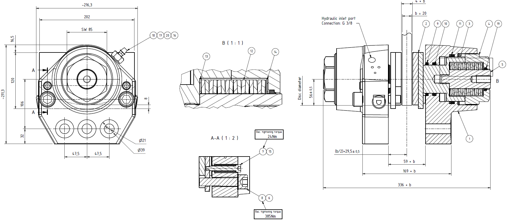
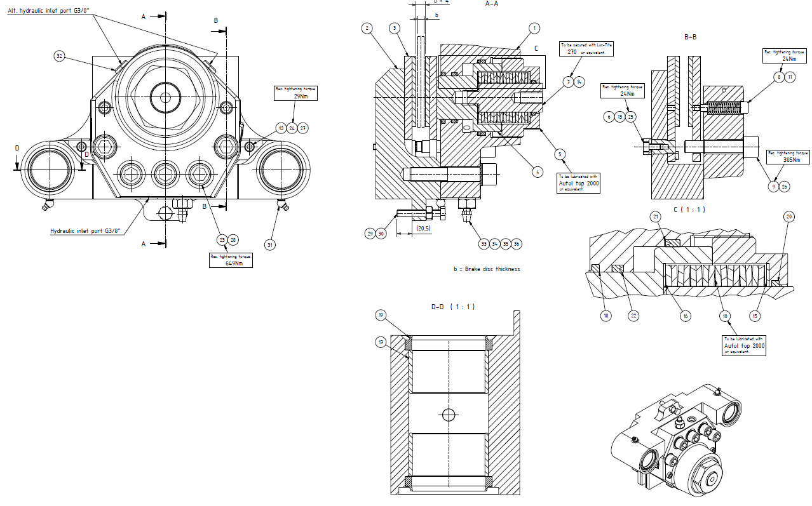

# Brakes Replacement

| **Requested by:** | **AURA** |
|-------------------|----------|
| **Doc. Code**     | #{documentCode}       |
| **Editor:**       | A. Izpizua         |
| **Approved by:**  | Samuel Bellver         |

## Index

- [Brakes Replacement](#brakes-replacement)
  - [Index](#index)
  - [Introducción](#introducción)
  - [Lista de documentos de referencia](#lista-de-documentos-de-referencia)
  - [Sustitución de las pastillas de Azimut](#sustitución-de-las-pastillas-de-azimut)
    - [Componentes del freno de azimuth](#componentes-del-freno-de-azimuth)
    - [Preparativos](#preparativos)
    - [Reemplazo de pastillas de freno](#reemplazo-de-pastillas-de-freno)
      - [Mecanizado de los pastillas](#mecanizado-de-los-pastillas)
    - [Ajuste de la fuerza de frenado](#ajuste-de-la-fuerza-de-frenado)
    - [Procedimiento de asentamiento de los frenos](#procedimiento-de-asentamiento-de-los-frenos)
      - [General](#general)
      - [Preparativos](#preparativos-1)
      - [Tiempo de procesamiento](#tiempo-de-procesamiento)
      - [Asentamiento](#asentamiento)
      - [Mecanizado de los pastillas](#mecanizado-de-los-pastillas-1)
      - [Detalles del test:](#detalles-del-test)
  - [Sustitución de las pastillas de Elevación](#sustitución-de-las-pastillas-de-elevación)
    - [Componentes del freno de elevación](#componentes-del-freno-de-elevación)
    - [Preparativos](#preparativos-2)
    - [Reemplazo de pastillas de freno](#reemplazo-de-pastillas-de-freno-1)
      - [Mecanizado de los pastillas](#mecanizado-de-los-pastillas-2)
    - [Ajuste de la fuerza de frenado](#ajuste-de-la-fuerza-de-frenado-1)
    - [Procedimiento de asentamiento de los frenos](#procedimiento-de-asentamiento-de-los-frenos-1)
      - [General](#general-1)
      - [Preparativos](#preparativos-3)
      - [Tiempo de procesamiento](#tiempo-de-procesamiento-1)
      - [Asentamiento](#asentamiento-1)
      - [Detalles del test:](#detalles-del-test-1)
  - [Liberar frenos de manera individual](#liberar-frenos-de-manera-individual)

## Introducción

El siguiente documento describe el procedimiento que hay que realizar para sustituir las zapatas de los frenos de
azimuth / Eleevación. El documento se divide en 2 partes, la primera parte describe como sustituir el freno
mecánicamente y la segunda parte describe como hay que manipular el sistema de seguridad para permitir su sustitución.

## Lista de documentos de referencia

|**Nº**|**DOCUMENTO**|**CÓDIGO**|**VERSIÓN**|
|--|---------|------|-------|
|1 |Installation, Operation & Maintenance of Azimuth disc brake|M0343||
|2 |Installation, Operation & Maintenance of Elvation disc brake|M0344||

## Sustitución de las pastillas de Azimut

### Componentes del freno de azimuth

|**Nº** |**Componente**                                   |
|-------|-------------------------------------------------|
|1      |Carcasa freno (braking housing)                  |
|2      |Pastilla freno (brake pad)                       |
|3      |Piston (piston)                                  |
|4      |Tuerca de ajuste (adjustment nut)                |
|5      |Columna Guía (Guide column)                      |
|6      |Arandela de seguridad (Lock washer)              |
|7      |Tornillo muelle de reotrno (Return spring screw) |
|8      |Pasadores guía (Guide pin)                       |
|9      |Escobilla (Wiper)                                |
|10     |Anillo retención (U-ring)                        |
|11     |Anillo retención (U-ring)                        |
|12     |Muelle de disco (Disc Spring Pack)               |
|13     |Arandela (washer)                                |
|14     |Arandela (washer)                                |
|15     |Muelle de retorno (Return spring)                |
|16     |Sellado (Bonded seal)                            |
|17     |Purgador (Bleeder)                               |
|18     |Tapon plástico (Plastic plug)                    |
|19     |Escobilla (Wiper)                                |
|20     |Conexión (Nipple)                                |

### Preparativos

Antes de iniciar el proceso de sustitución de la pastilla, asegurar que el freno y disco estén limpios y seco. Si las
pastillas se contaminan con aceite, disminuirá la capacidad nominal de frenado.

Antes de remplazar la pastilla, si el disco está sucio de grasa o aceite, limpiar la superficie con un disolvente que no
deje residuos. Si la zona de frenado del disco está oxidada, límpielo con un papel abrasivo fino y retire el polvo con
un paño limpio y solvente.

### Reemplazo de pastillas de freno

1. Gire la tuerca de ajuste (4) hacia afuera, hasta que sobresalga 29 mm de la carcasa del freno (1)

2. Presurice el freno / abrir el freno, [ver paso XXX(descrito por Tekniker).]{.mark}

3. Retire los pasadores guía (8) y los tornillos del muelle de retorno (15).

4. Deslice la pastilla de freno (2) hacia arriba y hacia afuera.

5. Previamente a instalar la pastilla nueva, mecanizar según apartado 3.2.1

6. Deslice la pastilla de freno (2) nueva hacia adentro.

7. Instale los pasadores guía (8) y los tornillos del resorte de retorno (15). Apriete los tornillos según el dibujo.

8. Ajuste la fuerza de frenado según el capítulo 3.3.

Se recomienda instalar pastillas de freno nuevas según apartado 3.4, para maximizar la fuerza.

#### Mecanizado de los pastillas

Para conseguir un correcta superficie de frenado deberemos mecanizar previamente las pastillas de freno en el taller con
el objetivo de eliminar material y uniformizar la superficie de la pastilla para conseguir un buen frenado.

Con este mecanizado debemos evitar realizar señales en la pastilla y dejar la pastilla lo más uniforme posible.

### Ajuste de la fuerza de frenado

La fuerza de frenado debe ajustarse cuando la distancia entre la columna guía (5) y la tuerca de ajuste (4) es superior
a 1,5 mm o como cuando la distancia entre el disco y las pastillas de freno son máx. 2x3,5mm.

El procedimiento de ajuste debe realizarse cuando el freno está activado (sin presión hidráulica).

**Tabla Capacidad de fuerza de frenado en relación con el la distancia entre freno y pastilla**

| **Capacidad** | **Distancia columna guía (5)/ tueca ajuste (4) (mm)** | **Distancia disco / pastillla (mm)** |
|---------------|-------------------------------------------------------|--------------------------------------|
| 100%          | 0                                                     | 2                                    |
| 91,5%         | 0,5                                                   | 2,5                                  |
| 83%           | 1                                                     | 3                                    |
| 74%           | 1,5                                                   | 3,5                                  |

1. Libere el freno de la presión hidráulica, [ver apartado XXX descrito por tekinker]{.mark}.

2. Gire la tuerca de ajuste (4) en ambos lados hacia adentro hasta que la columna guía (5) en el orificio central de la
    tuerca de ajuste (4) quede al ras con la superficie exterior de la tuerca.

### Procedimiento de asentamiento de los frenos

#### General

Para lograr el rendimiento óptimo de los frenos de disco, es importante realizar un bruñido (calentamiento) entre las
pastillas de freno y el disco.

El asentamiento de las pastillas con el disco es generalmente un proceso que tiene el objetivo de:

1. Conseguir que toda la superficie de las pastillas de freno esté en pleno contacto con el disco, y

2. Eliminar material y uniformizar la superficie de la pastilla.

#### Preparativos

Antes de iniciar el proceso, asegurar que las pastillas de freno y el disco estén limpios y seco. Si las pastillas están
contaminadas con aceite, puede que sea necesario reemplazarlas. Empapado en aceite no proporcionarán la capacidad
nominal de frenado.

Si el disco está sucio de grasa o aceite, limpiar la superficie con un disolvente que no deje residuos. Si la zona de
frenado del disco está oxidada, límpielo con un papel abrasivo fino y retire el polvo con un paño limpio y solvente.

#### Tiempo de procesamiento

El tiempo requerido para el proceso de asentamiento variará dependiendo de la severidad del proceso requerido. servicio
de frenado. Esto se puede determinar mejor en el lugar de trabajo basándose en las experiencias previas.

#### Asentamiento  

Para conseguir un correcto asentamiento, hay que realizar al menos 20 paradas de emergencia y en cada una de ellas
comprobar que la capacidad de frenado va aumentando, observando la distancia recorrida por el TMA durante el frenado de
emergencia.

Para realizar la parada de emergencia hay que by-pasear las señales de parada del aceite en caso de emergencia. El
último test se realizar con el sistema de aceite sin bypasear para comprobar el frenado real de los frenos de azimuth.
La acción de frenado se realizar con todos los frenos activados al mismo tiempo.

Si la superficie del disco comienza a vidriarse mostrando depósitos brillantes de material de fricción en el disco
superficie, retire cualquier vidriado de la superficie del disco con un papel abrasivo fino.

#### Mecanizado de los pastillas

Para conseguir un correcta superficie de frenado deberemos mecanizar previamente las pastillas de freno en el taller con
el objetivo de eliminar material y uniformizar la superficie de la pastilla para conseguir un buen frenado.

Con este mecanizado debemos evitar realizar señales en la pastilla y dejar la pastilla lo más uniforme posible.

#### Detalles del test:

1. **Ciclos** +90º a -90º / 8 frenos (pares enfrentados)

2. **Velocidad:** 2 grados por segundo, aumentar la velocidad hasta 3,5 grados por segundo, máximo.

3. **Distancia de frenada**: En esta situación comprobar la distancia requerida para frenar el TMA

**Nota: Bypasear el disparo del OSS.**

## Sustitución de las pastillas de Elevación

### Componentes del freno de elevación

|**Nº** |**Componente**                                   |
|---    |-----------------------------------------------  |
|1      |Carcasa freno (braking housing)                  |
|2      |Soporte (support)                                |
|3      |Pastilla freno (brake pad)                       |
|4      |Piston (piston)                                  |
|5      |Tuerca de ajuste (adjustment nut)                |
|6      |Pasadores guía (Guide pin)                       |
|7      |Columna Guía (Guide column)                      |
|8      |Tornillo Muelle de retorno (Return spring screw) |
|9      |Pasadores guía (Guide pin)                       |
|10     |Muelle de disco (Disc Spring Pack)               |
|11     |Muelle de retorno (Return spring)                |
|12     |Placa de bloque (Lock Plate)                     |
|13     |Placa de bloque (Lock Plate)                     |
|14     |Arandela bloqueo (Shim washer)                   |
|15     |Arandela (Washer)                                |
|16     |Arandela (Washer)                                |
|17     |Casquillo (Bushing)                              |
|18     |Escobilla (Wiper)                                |
|19     |Escobilla (Wiper)                                |
|20     |Escobilla (Wiper)                                |
|21     |Anillo retención (U-ring)                        |
|22     |Anillo retención (U-ring)                        |
|23     |Tornillo MC6S (Screw MC6S)                       |
|24     |Tornillo MC6S (Screw MC6S)                       |
|25     |Tornillo MC6S (Screw MC6S)                       |
|26     |Arandela de Seguridad (Lock washer)              |
|27     |Arandela de Seguridad (Nord Lock washer)         |
|28     |Arandela de Seguridad (Nord Lock washer)         |
|29     |Tuerca M6M (Nut M6M)                             |
|30     |Tornillo M6S (Screw M6M)                         |
|31     |Engrasador (Grease Fifting)                      |
|32     |Tapon (Plug IT6)                                 |
|33     |Tapon Plastico (Plastic plug)                    |
|34     |Purgador (Bleeder)                               |
|35     |Conexión (Nipple)                                |
|36     |Sellado (Bonded seal)                            |

### Preparativos

Antes de iniciar el proceso de sustitución de la pastilla, asegurar que el freno y disco estén limpios y seco. Si las
pastillas se contaminan con aceite, disminuirá la capacidad nominal de frenado.

Antes de remplazar la pastilla, si el disco está sucio de grasa o aceite, limpiar la superficie con un disolvente que no
deje residuos. Si la zona de frenado del disco está oxidada, límpielo con un papel abrasivo fino y retire el polvo con
un paño limpio y solvente.

### Reemplazo de pastillas de freno

1. Insertar locking pins

2. Gire la tuerca de ajuste (5) hacia afuera, hasta que sobresalga 29 mm de la carcasa del freno (1)

3. Presurice el freno / abrir el freno, [ver paso XXX(descrito por Tekniker).]{.mark}

4. Retire los pasadores guía (9) y los tornillos del muelle de retorno (8) en la carcasa del freno (1) y retire las
  placas de bloqueo (12) (13) y los pasadores guía (6) para el soporte SKP 95-SA.

5. Deslice la pastilla de freno (3) hacia arriba y hacia afuera.

6. Previamente a instalar la pastilla nueva, mecanizar según apartado 4.2.1.

7. Deslice la pastilla de freno (3) nueva hacia adentro.

8. Instale los pasadores guía (9) y los tornillos del resorte de retorno (8) en la carcasa del freno (1) e instale las
    placas de bloqueo (12) (13) y los pasadores guía (6) para el soporte SKP 95-SA. Apriete los tornillos según el
    dibujo.

9. Ajuste la fuerza de frenado según el [capítulo 4.3.]{.mark}

Se recomienda instalar pastillas de freno nuevas [según según apartado 4.4,]{.mark} para maxiimizar la fuerza.

#### Mecanizado de los pastillas

Para conseguir un correcta superficie de frenado deberemos mecanizar previamente las pastillas de freno en el taller con
el objetivo de eliminar material y uniformizar la superficie de la pastilla para conseguir un buen frenado.

Con este mecanizado debemos evitar realizar señales en la pastilla y dejar la pastilla lo más uniforme posible.

### Ajuste de la fuerza de frenado

La fuerza de frenado debe ajustarse cuando la distancia entre la columna guía (7) y la tuerca de ajuste (5) es superior
a 1,5 mm o como cuando la distancia entre el disco y las pastillas de freno son máx. 2x2,75mm.

El procedimiento de ajuste debe realizarse cuando el freno está activado (sin presión hidráulica).

**Tabla Capacidad de fuerza de frenado en relación con el la distancia entre freno y pastilla**

| **Capacidad** | **Distancia columna guía (7)/ tueca ajuste (5) (mm)** | **Distancia disco / pastillla (mm)** |
|---------------|-------------------------------------------------------|--------------------------------------|
| 100%          | 0                                                     | 2                                    |
| 91,5%         | 0,5                                                   | 2,25                                 |
| 83%           | 1                                                     | 2,5                                  |
| 74%           | 1,5                                                   | 2,75                                 |

1. Insertar locking pins

2. Libere el freno de la presión hidráulica, [ver apartado]{.mark} XXXX.

3. Gire la tuerca de ajuste (5) en ambos lados hacia adentro hasta que la columna guía (7) en el orificio central de la
  tuerca de ajuste (5) quede al ras con la superficie exterior de la tuerca.

### Procedimiento de asentamiento de los frenos

#### General

Para lograr el rendimiento óptimo de los frenos de disco, es importante realizar un bruñido (calentamiento) entre las
pastillas de freno y el disco.

El asentamiento de las pastillas con el disco es generalmente un proceso que tiene el objetivo de:

1. Conseguir que toda la superficie de las pastillas de freno esté en pleno contacto con el disco, y

2. Eliminar material y uniformizar la superficie de la pastilla.

#### Preparativos

Antes de iniciar el proceso, asegurar que las pastillas de freno y el disco estén limpios y seco. Si las pastillas están
contaminadas con aceite, puede que sea necesario reemplazarlas. Empapado en aceite no proporcionarán la capacidad
nominal de frenado.

Si el disco está sucio de grasa o aceite, limpiar la superficie con un disolvente que no deje residuos. Si la zona de
frenado del disco está oxidada, límpielo con un papel abrasivo fino y retire el polvo con un paño limpio y solvente.

#### Tiempo de procesamiento

El tiempo requerido para el proceso de asentamiento variará dependiendo de la severidad del proceso requerido. servicio
de frenado. Esto se puede determinar mejor en el lugar de trabajo basándose en las experiencias previas.

#### Asentamiento

Para conseguir un correcto asentamiento, hay que realizar al menos 20 paradas de emergencia y en cada una de ellas
comprobar que la capacidad de frenado va aumentando, observando la distancia recorrida por el TMA durante el frenado de
emergencia.

Para realizar la parada de emergencia hay que by-pasear las señales de parada del aceite en caso de emergencia. El
último test se realizar con el sistema de aceite sin bypasear para comprobar el frenado real de los frenos de elevación.
La acción de frenado se realizar con todos los frenos activados al mismo tiempo.

Si la superficie del disco comienza a vidriarse mostrando depósitos brillantes de material de fricción en el disco
superficie, retire cualquier vidriado de la superficie del disco con un papel abrasivo fino.

#### Detalles del test:

1. **Ciclos** +20º a -20º / con los frenos de elevación activos

2. **Velocidad:** 3,5 grados por segundo

3. **Distancia de frenada**: En esta situación comprobar la distancia requerida para frenar el TMA

**Nota: Bypasear el disparo del OSS.**

## Liberar frenos de manera individual

1. Abrir el programa PAS4000

> 

2. Abrir el proyecto TMA_IS con botón derecho y Activate Project

> 

3. Meter la credenciales del safety

> 

4. Abrir el item "Variable lists"

> 

5. Desplegamos las variables pulsando sobre ellas (rojo) y comenzamos a visualizarlas dando al play (azul)

> 

6. Buscar las variables sdoBKAZ1, sdoBkAZ2, ...

> 

7. Doble click en la comuna "force/control value" y en el dialogo elegir el valor (rojo) y Force Now (Azul). TRUE =
    abrir freno, FALSE = cerrar freno

8. Una vez forzado aparece una F junto al símbolo

> 

9. **Para detener el forzado, botón derecho sobre la variable deseada y "Stop Forcing Variables"**

> 

