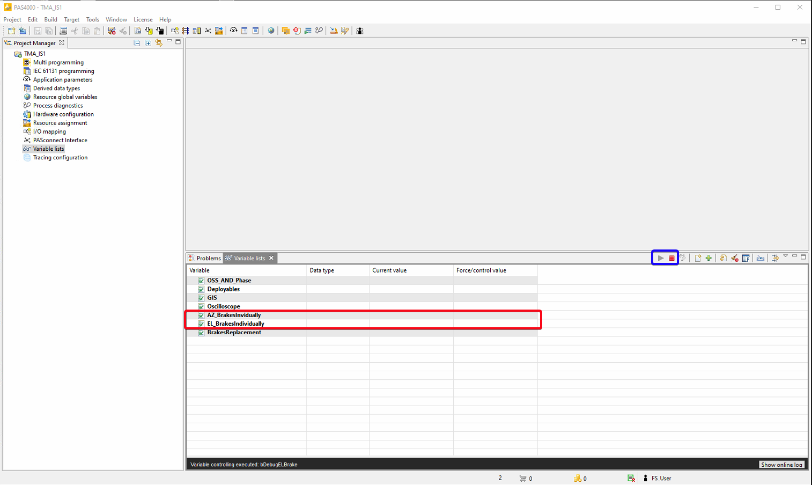
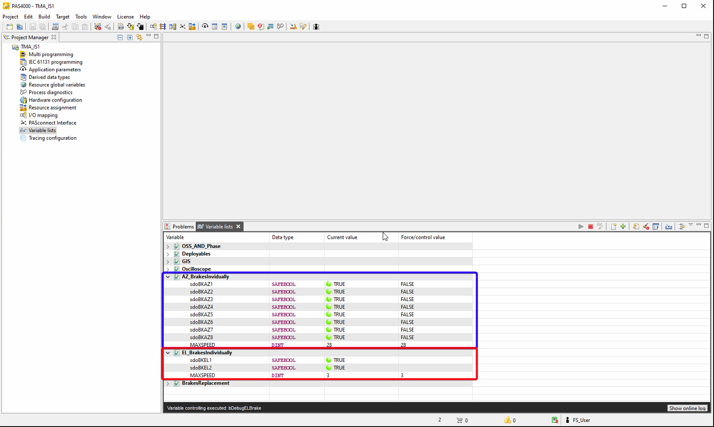

# Brakes Replacement

| **Requested by:** | **AURA**  |
| ----------------------- | --------------- |
| **Doc. Code**     | #{documentCode} |
| **Editor:**       | A. Izpizua      |
| **Approved by:**  | Samuel Bellver  |

## Index

- [Brakes Replacement](#brakes-replacement)
  - [Index](#index)
  - [Introducción](#introducción)
  - [Lista de documentos de referencia](#lista-de-documentos-de-referencia)
  - [Sustitución de las pastillas de Azimut](#sustitución-de-las-pastillas-de-azimut)
    - [Componentes del freno de azimuth](#componentes-del-freno-de-azimuth)
    - [Preparativos](#preparativos)
    - [Reemplazo de pastillas de freno](#reemplazo-de-pastillas-de-freno)
    - [Ajuste de la fuerza de frenado](#ajuste-de-la-fuerza-de-frenado)
    - [Procedimiento de asentamiento de los frenos](#procedimiento-de-asentamiento-de-los-frenos)
      - [General](#general)
      - [Preparativos](#preparativos-1)
      - [Tiempo de procesamiento](#tiempo-de-procesamiento)
      - [Asentamiento](#asentamiento)
      - [Detalles del test:](#detalles-del-test)
  - [Sustitución de las pastillas de Elevación](#sustitución-de-las-pastillas-de-elevación)
    - [Componentes del freno de elevación](#componentes-del-freno-de-elevación)
    - [Preparativos](#preparativos-2)
    - [Reemplazo de pastillas de freno](#reemplazo-de-pastillas-de-freno-1)
    - [Ajuste de la fuerza de frenado](#ajuste-de-la-fuerza-de-frenado-1)
    - [Procedimiento de asentamiento de los frenos](#procedimiento-de-asentamiento-de-los-frenos-1)
      - [General](#general-1)
      - [Preparativos](#preparativos-3)
      - [Tiempo de procesamiento](#tiempo-de-procesamiento-1)
      - [Asentamiento](#asentamiento-1)
      - [Detalles del test:](#detalles-del-test-1)
  - [Liberar frenos de manera individual](#liberar-frenos-de-manera-individual)
  - [Manejar limites de sobrevelocidad en el TMA-IS](#manejar-limites-de-sobrevelocidad-en-el-tma-is)
  - [Liberar frenos para asentamiento](#liberar-frenos-para-asentamiento)

## Introducción

El siguiente documento describe el procedimiento que hay que realizar para sustituir las zapatas de los frenos de
azimuth / Eleevación. El documento se divide en 2 partes, la primera parte describe como sustituir el freno
mecánicamente y la segunda parte describe como hay que utilizar el sistema de seguridad para permitir su sustitución.

## Lista de documentos de referencia

| **Nº** | **DOCUMENTO**                                          | **CÓDIGO** | **VERSIÓN** |
| ------------- | ------------------------------------------------------------ | ----------------- | ------------------ |
| 1             | Installation, Operation & Maintenance of Azimuth disc brake  | M0343             |                    |
| 2             | Installation, Operation & Maintenance of Elvation disc brake | M0344             |                    |

## Sustitución de las pastillas de Azimut

### Componentes del freno de azimuth

| **Nº** | **Componente**                             |
| ------------- | ------------------------------------------------ |
| 1             | Carcasa freno (braking housing)                  |
| 2             | Pastilla freno (brake pad)                       |
| 3             | Piston (piston)                                  |
| 4             | Tuerca de ajuste (adjustment nut)                |
| 5             | Columna Guía (Guide column)                     |
| 6             | Arandela de seguridad (Lock washer)              |
| 7             | Tornillo muelle de reotrno (Return spring screw) |
| 8             | Pasadores guía (Guide pin)                      |
| 9             | Escobilla (Wiper)                                |
| 10            | Anillo retención (U-ring)                       |
| 11            | Anillo retención (U-ring)                       |
| 12            | Muelle de disco (Disc Spring Pack)               |
| 13            | Arandela (washer)                                |
| 14            | Arandela (washer)                                |
| 15            | Muelle de retorno (Return spring)                |
| 16            | Sellado (Bonded seal)                            |
| 17            | Purgador (Bleeder)                               |
| 18            | Tapon plástico (Plastic plug)                   |
| 19            | Escobilla (Wiper)                                |
| 20            | Conexión (Nipple)                               |

### Preparativos

Antes de iniciar el proceso de sustitución de la pastilla, asegurar que el freno y disco estén limpios y secos. Si las
pastillas se contaminan con aceite, disminuirá la capacidad nominal de frenado.

Antes de remplazar la pastilla, si el disco está sucio de grasa o aceite, limpiar la superficie con un disolvente que no
deje residuos. Si la zona de frenado del disco está oxidada, límpielo con un papel abrasivo fino y retire el polvo con
un paño limpio y solvente.

### Reemplazo de pastillas de freno

1. Gire la tuerca de ajuste (4) hacia afuera, hasta que sobresalga 29 mm de la carcasa del freno (1)
2. Presurice el freno / abrir el freno, ver [como liberar frenos](#liberar-frenos-de-manera-individual)
3. Retire los pasadores guía (8) y los tornillos del muelle de retorno (15).
4. Deslice la pastilla de freno (2) hacia arriba y hacia afuera.
5. Deslice la pastilla de freno (2) nueva hacia adentro.
6. Instale los pasadores guía (8) y los tornillos del resorte de retorno (15). Apriete los tornillos según el dibujo.
7. Ajuste la fuerza de frenado según el capítulo [Ajuste de la fuerza de frenado](#ajuste-de-la-fuerza-de-frenado)

Se recomienda instalar pastillas de freno nuevas según apartado 3.4, para maximizar la fuerza.

### Ajuste de la fuerza de frenado

La fuerza de frenado debe ajustarse cuando la distancia entre la columna guía (5) y la tuerca de ajuste (4) es superior
a 1,5 mm o como cuando la distancia entre el disco y las pastillas de freno son máx. 2x3,5mm.

El procedimiento de ajuste debe realizarse cuando el freno está activado (sin presión hidráulica).

**Tabla Capacidad de fuerza de frenado en relación con el la distancia entre freno y pastilla**

| **Capacidad** | **Distancia columna guía (5)/ tueca ajuste (4) (mm)** | **Distancia disco / pastillla (mm)** |
| ------------------- | ------------------------------------------------------------ | ------------------------------------------ |
| 100%                | 0                                                            | 2                                          |
| 91,5%               | 0,5                                                          | 2,5                                        |
| 83%                 | 1                                                            | 3                                          |
| 74%                 | 1,5                                                          | 3,5                                        |

1. Libere el freno de la presión hidráulica, [ver apartado XXX descrito por tekinker]{.mark}.
2. Gire la tuerca de ajuste (4) en ambos lados hacia adentro hasta que la columna guía (5) en el orificio central de la
   tuerca de ajuste (4) quede al ras con la superficie exterior de la tuerca.

### Procedimiento de asentamiento de los frenos

#### General

Para lograr el rendimiento óptimo de los frenos de disco, es importante realizar un bruñido (calentamiento) entre las
pastillas de freno y el disco.

El asentamiento de las pastillas con el disco es generalmente un proceso que tiene el objetivo de:

1. Conseguir que toda la superficie de las pastillas de freno esté en pleno contacto con el disco, y
2. Eliminar material y uniformizar la superficie de la pastilla.

#### Preparativos

Antes de iniciar el proceso, asegurar que las pastillas de freno y el disco estén limpios y seco. Si las pastillas están
contaminadas con aceite, puede que sea necesario reemplazarlas. Empapado en aceite no proporcionarán la capacidad
nominal de frenado.

Si el disco está sucio de grasa o aceite, limpiar la superficie con un disolvente que no deje residuos. Si la zona de
frenado del disco está oxidada, límpielo con un papel abrasivo fino y retire el polvo con un paño limpio y solvente.

#### Tiempo de procesamiento

El tiempo requerido para el proceso de asentamiento variará dependiendo de la severidad del proceso requerido. servicio
de frenado. Esto se puede determinar mejor en el lugar de trabajo basándose en las experiencias previas.

#### Asentamiento

Para conseguir un correcto asentamiento, hay que accionar cada par de frenos individualmente, siguiendo las instrucciones del punto 2. Accionado un par de frenos y el resto de frenos abiertos, el par de frenos debe deslizar contra el disco hasta recorrer una distancia de 500 metros, recorrer 20 veces un movimiento de 180 grados.

En cada movimiento, realizar una pausa y dejar que el disco se enfríe.

Cada 10 movimientos revisar que la superficie del disco no comienza a vidriarse. Si la superficie muestra depósitos brillantes de material de fricción en el disco superficie, retire cualquier vidriado de la superficie del disco con un papel abrasivo fino.

#### Detalles del test:

1. **Ciclos** +90º a -90º / 2 frenos (pares enfrentados) durante rea.
2. **Velocidad:** 3 grados por segundo, hasta recorrer 500 metros con cada par de frenos, equivalente a repetir 20 veces el movimiento de 180.
3. **Distancia de frenada**: Una vez realizado el test con todos los frenos, realizar un frenado de emergencia y comprobar si la distancia de frenado está dentro de los requisitos definidos de 12º, para la velocidad máxima. En caso de no cumplirse este requisito volver a repetir el procedimiento para una tanda de 5 ciclos.
4. **Finalización del Test**: La distancia de frenado está dentro de los parámetros exigidos o no ha se conseguido recortar la distancia entre dos frenadas de emergencia separadas por 5 ciclos.

## Sustitución de las pastillas de Elevación

### Componentes del freno de elevación

| **Nº** | **Componente**                             |
| ------------- | ------------------------------------------------ |
| 1             | Carcasa freno (braking housing)                  |
| 2             | Soporte (support)                                |
| 3             | Pastilla freno (brake pad)                       |
| 4             | Piston (piston)                                  |
| 5             | Tuerca de ajuste (adjustment nut)                |
| 6             | Pasadores guía (Guide pin)                      |
| 7             | Columna Guía (Guide column)                     |
| 8             | Tornillo Muelle de retorno (Return spring screw) |
| 9             | Pasadores guía (Guide pin)                      |
| 10            | Muelle de disco (Disc Spring Pack)               |
| 11            | Muelle de retorno (Return spring)                |
| 12            | Placa de bloque (Lock Plate)                     |
| 13            | Placa de bloque (Lock Plate)                     |
| 14            | Arandela bloqueo (Shim washer)                   |
| 15            | Arandela (Washer)                                |
| 16            | Arandela (Washer)                                |
| 17            | Casquillo (Bushing)                              |
| 18            | Escobilla (Wiper)                                |
| 19            | Escobilla (Wiper)                                |
| 20            | Escobilla (Wiper)                                |
| 21            | Anillo retención (U-ring)                       |
| 22            | Anillo retención (U-ring)                       |
| 23            | Tornillo MC6S (Screw MC6S)                       |
| 24            | Tornillo MC6S (Screw MC6S)                       |
| 25            | Tornillo MC6S (Screw MC6S)                       |
| 26            | Arandela de Seguridad (Lock washer)              |
| 27            | Arandela de Seguridad (Nord Lock washer)         |
| 28            | Arandela de Seguridad (Nord Lock washer)         |
| 29            | Tuerca M6M (Nut M6M)                             |
| 30            | Tornillo M6S (Screw M6M)                         |
| 31            | Engrasador (Grease Fifting)                      |
| 32            | Tapon (Plug IT6)                                 |
| 33            | Tapon Plastico (Plastic plug)                    |
| 34            | Purgador (Bleeder)                               |
| 35            | Conexión (Nipple)                               |
| 36            | Sellado (Bonded seal)                            |

### Preparativos

Antes de iniciar el proceso de sustitución de la pastilla, asegurar que el freno y disco estén limpios y seco. Si las
pastillas se contaminan con aceite, disminuirá la capacidad nominal de frenado.

Antes de remplazar la pastilla, si el disco está sucio de grasa o aceite, limpiar la superficie con un disolvente que no
deje residuos. Si la zona de frenado del disco está oxidada, límpielo con un papel abrasivo fino y retire el polvo con
un paño limpio y solvente.

### Reemplazo de pastillas de freno

1. Insertar locking pins
2. Gire la tuerca de ajuste (5) hacia afuera, hasta que sobresalga 29 mm de la carcasa del freno (1)
3. Presurice el freno / abrir el freno, ver [como liberar frenos](#liberar-frenos-de-manera-individual)
4. Retire los pasadores guía (9) y los tornillos del muelle de retorno (8) en la carcasa del freno (1) y retire las
   placas de bloqueo (12) (13) y los pasadores guía (6) para el soporte SKP 95-SA.
5. Deslice la pastilla de freno (3) hacia arriba y hacia afuera.
6. Deslice la pastilla de freno (3) nueva hacia adentro.
7. Instale los pasadores guía (9) y los tornillos del resorte de retorno (8) en la carcasa del freno (1) e instale las
   placas de bloqueo (12) (13) y los pasadores guía (6) para el soporte SKP 95-SA. Apriete los tornillos según el
   dibujo.
8. Ajuste la fuerza de frenado según el [ajuste de la fuerza de frenado](#ajuste-de-la-fuerza-de-frenado-1)

Se recomienda instalar pastillas de freno nuevas [según según apartado 4.4,]{.mark} para maxiimizar la fuerza.

### Ajuste de la fuerza de frenado

La fuerza de frenado debe ajustarse cuando la distancia entre la columna guía (7) y la tuerca de ajuste (5) es superior
a 1,5 mm o como cuando la distancia entre el disco y las pastillas de freno son máx. 2x2,75mm.

El procedimiento de ajuste debe realizarse cuando el freno está activado (sin presión hidráulica).

**Tabla Capacidad de fuerza de frenado en relación con el la distancia entre freno y pastilla**

| **Capacidad** | **Distancia columna guía (7)/ tueca ajuste (5) (mm)** | **Distancia disco / pastillla (mm)** |
| ------------------- | ------------------------------------------------------------ | ------------------------------------------ |
| 100%                | 0                                                            | 2                                          |
| 91,5%               | 0,5                                                          | 2,25                                       |
| 83%                 | 1                                                            | 2,5                                        |
| 74%                 | 1,5                                                          | 2,75                                       |

1. Insertar locking pins
2. Libere el freno de la presión hidráulica, [ver apartado]{.mark} XXXX.
3. Gire la tuerca de ajuste (5) en ambos lados hacia adentro hasta que la columna guía (7) en el orificio central de la
   tuerca de ajuste (5) quede al ras con la superficie exterior de la tuerca.

### Procedimiento de asentamiento de los frenos

#### General

Para lograr el rendimiento óptimo de los frenos de disco, es importante realizar un bruñido (calentamiento) entre las
pastillas de freno y el disco.

El asentamiento de las pastillas con el disco es generalmente un proceso que tiene el objetivo de:

1. Conseguir que toda la superficie de las pastillas de freno esté en pleno contacto con el disco, y
2. Eliminar material y uniformizar la superficie de la pastilla.

#### Preparativos

Antes de iniciar el proceso, asegurar que las pastillas de freno y el disco estén limpios y seco. Si las pastillas están
contaminadas con aceite, puede que sea necesario reemplazarlas. Empapado en aceite no proporcionarán la capacidad
nominal de frenado.

Si el disco está sucio de grasa o aceite, limpiar la superficie con un disolvente que no deje residuos. Si la zona de
frenado del disco está oxidada, límpielo con un papel abrasivo fino y retire el polvo con un paño limpio y solvente.

#### Tiempo de procesamiento

El tiempo requerido para el proceso de asentamiento variará dependiendo de la severidad del proceso requerido. servicio
de frenado. Esto se puede determinar mejor en el lugar de trabajo basándose en las experiencias previas.

#### Asentamiento

Para conseguir un correcto asentamiento, hay que accionar cada freno de elevación individualmente, siguiendo las instrucciones del punto 2. Accionado un freno y el otro abierto, el freno debe deslizar contra el disco hasta recorrer una distancia de 500 metros, recorrer 90 veces un movimiento de 45 grados.

Cada 20 movimiento revisar que la superficie del disco no comienza a vidriarse. Si la superficie muestra depósitos brillantes de material de fricción en el disco, retire cualquier vidriado de la superficie del disco con un papel abrasivo fino.

#### Detalles del test:

1. **Ciclos** De 25º a 70º  / con un freno de elevación activos. Repetir para ambos frenos
2. **Velocidad:** 3,5 grados por segundo, hasta recorrer 500 metros con cada par de frenos, equivalente a repetir 90 veces el movimiento de 45º
3. **Distancia de frenada**: Una vez realizado el test con todos los frenos, realizar un frenado de emergencia y comprobar si la distancia de frenado está dentro de los requisitos definidos de 7º, para la velocidad máxima. En caso de no cumplirse este requisito volver a repetir el procedimiento para una tanda de 5 ciclos.
4. **Finalización del Test**: La distancia de frenado está dentro de los parámetros exigidos o no ha se conseguido recortar la distancia entre dos frenadas de emergencia separadas por 5 ciclos.

## Liberar frenos de manera individual

1. Abrir el programa PAS4000
   
2. Abrir el proyecto TMA_IS con botón derecho y Activate Project
   
3. Rellenar la credenciales del safety
   
4. Abrir el item "Variable lists"
   
5. Desplegamos las variables pulsando sobre ellas (rojo) y comenzamos a visualizarlas dando al play (azul)

   1. Para azimuth abrir la lista de variables AZ_BrakesInividually
   2. Para elevación abrir la lista de variables EL_BrakesInividually
      
6. Buscar las variables

   1. Para azimuth sdoBKAZ1, sdoBkAZ2, sdoBKAZ3, sdoBKAZ4, sdoBKAZ5, sdoBKAZ6, sdoBKAZ7 y sdoBKAZ8 en lista de variables AZ_BrakesInividually
   2. Para elevación sdoBKEL1, sdoBkEL2 en lista de variables EL_BrakesInividually
      
7. Doble click en la comuna "force/control value" y en el dialogo elegir el valor (rojo) y Force Now (Azul). TRUE =abrir freno, FALSE = cerrar freno
   
8. Una vez forzado aparece una F junto al símbolo
   
9. **Para detener el forzado, botón derecho sobre la variable deseada y "Stop Forcing Variables"**
   

## Manejar limites de sobrevelocidad en el TMA-IS

Para manejar los límites de sobrevelocidad en el sistema de seguridad se han añadido a la lista de variables las variables que limitan la velocidad máxima del telescopio. La variables se llaman MAXSPEED tanto para azimuth como para elevación pero están en la lista de AZ_BrakesIndividually o en la lista de EL_BrakesIndividually respectivamente.

Se introduce un valor numérico entero que tiene las unidades de la tabla siguiente. De esta manera si se introduce un valor de 10 para azimuth la velocidad máxima fijada será de 3.6 deg/s

| Eje       | Velocidad Por unidad | Valor máximo admitido | Velocidad Máxima equivalente | Valor mínimo admitido | Velocidad minima equivalente |
| --------- | -------------------- | ---------------------- | ----------------------------- | ---------------------- | ---------------------------- |
| Azimuth   | 0.36 deg/s           | 28                     | 10.08 deg/s                   | 2                      | 0.72 deg/s                   |
| Elevation | 1.44 deg/s           | 3                      | 4.32 deg/s                    | 1                      | 1.44 deg/s                   |

## Liberar frenos para asentamiento

Para liberar sólo los frenos requeridos para el asentamiento se ha creado otra lista de variables con las variables necesarias para realizar esta operación, BrakesReplacement.

Estas variables no liberarán algunos de los frenos, según el valor de las mismas y acorde a las siguientes tablas, y no verificarán que estos frenos no están liberados durante un periodo de tiempo de 10 minutos. Transcurrido ese tiempo, si se sigue con el ensayo el sistema dará una alarma equivalente a la falta de presión en los frenos.

Las variables utilizadas son iBrakeReplacementAz, iBrakeReplacementEl que permiten escoger el/los frenos que no se van a liberar (ver tabla más abajo) y bBrakeReplacementProcedure, que habilita la función con un valor de TRUE. No permite realizar esta operación en los ejes de azimuth y elevación al mismo tiempo, teniendo prioridad el eje de azimuth, es decir si la variable iBrakeReplacementAz tiene un valor superior a 0 la variable iBrakeReplacementEl será sobreescrita a 0.

| Variable            | Valor | Freno/s no liberado/s |
| ------------------- | ----- | --------------------- |
| iBrakeReplacementEL | 0     | ninguno de elevación |
| iBrakeReplacementEL | 1     | EL1                   |
| iBrakeReplacementEL | 2     | EL2                   |
| iBrakeReplacementAZ | 0     | ninguno de azimuth    |
| iBrakeReplacementAZ | 1     | AZ1 y AZ5             |
| iBrakeReplacementAZ | 2     | AZ2 y AZ6            |
| iBrakeReplacementAZ | 3     | AZ3 y AZ7             |
| iBrakeReplacementAZ | 4     | AZ4 y AZ8             |

La operación comienza (comienza a contar el temporizador) cuando el control de los ejes solicita la liberación de los frenos. Si se detiene el eje el procedimiento se da por finalizado y la variable de activación del procedimiento, bBrakeReplacementProcedure, se vuelve a sobreescribir a FALSE. Para volver a realizar otro nuevo test hay que volver a escribir esta variable a TRUE.

Para escribir las variables hacer doble click en la fila de la variable y la columna marcada como Force/control value, seleccionar el valor y pulsar sobre "Control Now".

